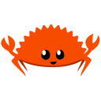

### Hi there! 

I'm Claude, part of the Developer Relations team at Kraken. <image src="emojis/kraken_appears.gif" width=20> 

I help developers integrate their projects smoothly with Kraken, strengthen our ties with the open-source community, and work to make every developer’s experience with Kraken as seamless as possible. 

I also maintain our [API Center](https://docs.kraken.com/api/) website, the one-stop hub for everything Kraken API. If you have ideas to improve our docs, want to see something added, or need anything clarified, just let me know! 

#### Projects

| Repository | Description | Role |
| - | - | - |
|  [api-go](https://github.com/krakenfx/api-go) | Go module for the Kraken APIs | Maintainer

#### In development

| Repository | Description | Role |
| - | - | - |
|  Python SDK | Python SDK for the Kraken APIs | Maintainer
|  Node SDK | JavaScript library for the Kraken APIs | Maintainer
|  Rust SDK | Rust crates and CLI for the Kraken APIs | Developer

#### Contacting me

There are multiple ways to reach out to me. You could contact me by email [claude.enriquez@kraken.com](mailto:claude.enriquez@kraken.com), connecting with me on [Linkedin](https://www.linkedin.com/in/claude-enriquez/), or by raising an issue on my [profile repository](https://github.com/claudeenriquez/claudeenriquez/issues).

Please note that I would never ask you for your password. Be weary of phishing scams and impersonators. 

For any account-related inquiries, write an email ticket on our [Support Center](https://support.kraken.com/contact).
